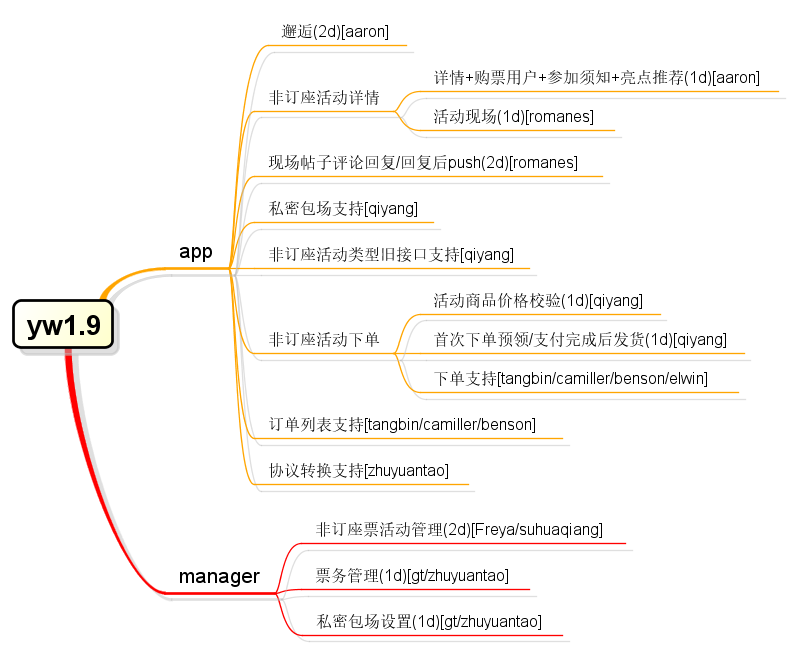
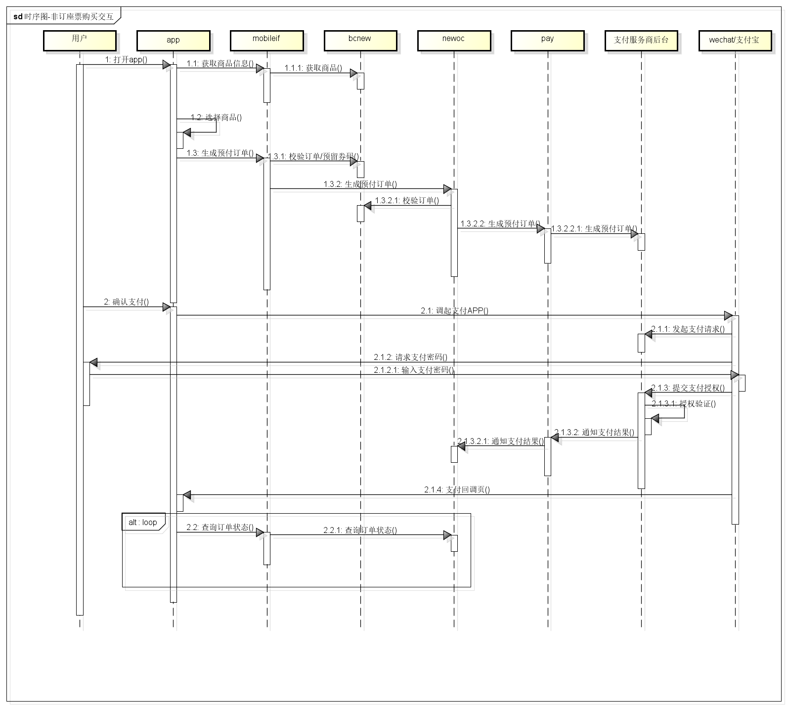
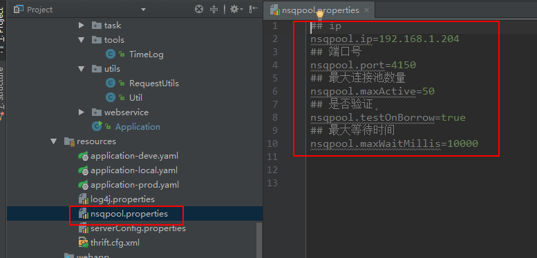
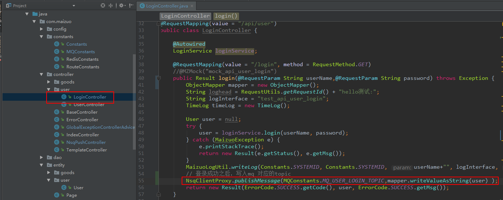
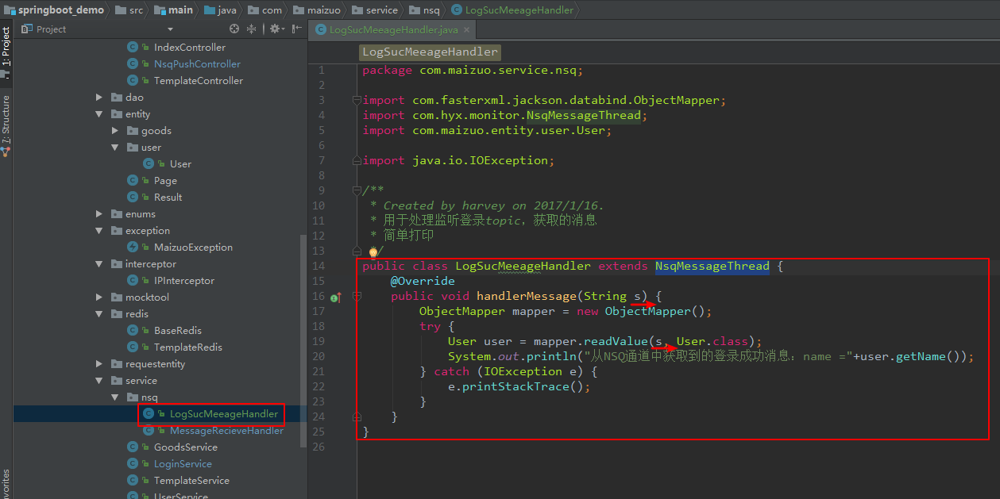
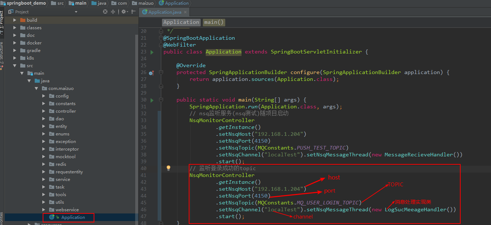

Spring-boot项目模板
=================

[TOC]

### 功能列表

- 基于Spring-boot框架
- 采用gradle构建
- 依赖maven仓库
- 无xml配置（yaml)
- 支持多环境配置
- 支持多数据源
- 支持缓存Redis
- API接口MOCK注解（@MZMOCK）
- HTTPClient工具 （commons自封装工具类）
- 日志（Log4j）工具（LogUtils）
- 常用时间类型转换（DateUtils & DateStyle）
- 常用域名枚举
- 错误码枚举
- 全局异常处理
- 单元测试用例（spring-test + mockito)
- 第三方服务调用
- 高频业务数据缓存（redis+thrift序列化）
- 常见业务场景demo
- 批处理（spring-batch）
- 任务调度
- MQ(NSQ)的使用


### 项目结构

该项目目录结构遵循spring-boot约定，详见如下：

    │  .gitignore   **git忽略配置**
    │  build.gradle **gradle构建脚本**
    │  gradlew
    │  gradlew.bat
    │  settings.gradle
    └─src
        ├─main
        │  ├─java
        │  │  └─com
        │  │      └─maizuo
        │  │          ├─Application.java         项目启动文件
        │  │          ├─batch                    批处理一级目录
        │  │          │  ├─builder
        │  │          │  └─handler
        │  │          ├─config                   配置类
        │  │          ├─constants                常量文件
        │  │          │  ├─goods
        │  │          │  └─user
        │  │          ├─dao                       数据库操作层
        │  │          ├─data                      数据结构体一级目录
        │  │          │  ├─entity                数据库层实体类，业务层实体类
        │  │          │  │  ├─card
        │  │          │  │  ├─job
        │  │          │  │  └─user
        │  │          │  ├─enums                 枚举类
        │  │          │  ├─request               入参实体类
        │  │          │  └─response              请求响应实体类
        │  │          ├─exception                 自定义异常和全局异常捕获
        │  │          ├─kit                       非SDK调用的第三方服务目录
        │  │          │  ├─goods
        │  │          │  │  ├─request           第三方服务入参实体类
        │  │          │  │  └─response          第三方服务响应实体类
        │  │          │  └─news
        │  │          ├─mocktool                   自定义mock注解
        │  │          ├─mq                         消息队列一级目录
        │  │          │  └─handler                消息队列业务处理类
        │  │          ├─redis                      redis缓存一级目录
        │  │          │  └─handler                redis业务处理类
        │  │          ├─service                    业务层
        │  │          ├─task                       任务调度
        │  │          ├─tools                      工具类
        │  │          ├─utils                      工具类
        │  │          └─web                        web业务一级目录
        │  │              ├─controller             控制器
        │  │              │  ├─card
        │  │              │  ├─goods
        │  │              │  └─user
        │  │              └─interceptor            拦截器
        │  ├─resources                              配置文件
        │  └─webapp                                 前端资源文件
        └─test                                       测试（spring-test + mockito)


### 依赖配置

虽然该项目采用`gradle`构建，但依然依赖的是`maven`，需要添加依赖的只需要修改文件`build.gradle`中相关依赖即可。

内部maven依赖搜索[地址](http://nexus.miz.so:8081/nexus/#welcome)

```
dependencies {
    //添加单元测试依赖
    compile("junit:junit:4.12")
}
```

### 环境配置设置

springboot启动时默认会读取application.yaml配置文件，只要在该文件中指定spring.profiles.active属性为application-{profile}.yaml中的{profile}字符串即可应用该文件中的配置。

### 数据源配置

使用数据库需要添加如下两项依赖

```
dependencies {
    compile("org.springframework.boot:spring-boot-starter-jdbc")
    compile("mysql:mysql-connector-java:5.1.6")
}
```

#### 单数据源

项目中只使用一个数据源的时候，需要在`application-{profile}.yaml`文件中配置如下配置项

```
spring:
  datasource:
    url: jdbc:mysql://ip:port/test
    driver-class-name: com.mysql.jdbc.Driver
    username: web
    password: 123456
```
spring-boot会自动配置`DataSource`和`JdbcTemplate`。

#### 多数据源

如果需要使用到多个数据源,首先`application-{profile}.yaml`中配置好对应数据源

```
datasource: #多数据源配置
  test1:
    url: jdbc:mysql://ip:port/test1
    driver-class-name: com.mysql.jdbc.Driver
    username: web
    password: xxxxxxx
  test2:
    url: jdbc:mysql://ip:port/test2
    driver-class-name: com.mysql.jdbc.Driver
    username: web
    password: xxxxxxx
```

配置好需要使用的数据源后，还要在`DatabaseConfig.java`文件中配置对应的DataSource和JdbcTemplate

DataSource配置代码如下：
``` java
@Bean(name = "ds1")
@ConfigurationProperties(prefix = "datasource.test1")
@Primary
public DataSource dataSourceTest1() {
    return DataSourceBuilder.create().build();
}

@Bean(name = "ds2")
@ConfigurationProperties(prefix = "datasource.test2")
public DataSource dataSourceTest2() {
    return DataSourceBuilder.create().build();
}
```

** 注意：配置多个DataSource时，必须要指定一个为主数据源，使用注解`@Primary`标识 **

JdbcTemplate配置代码如下：
``` java
@Bean(name = "jdbcTemplateTest1")
public JdbcTemplate jdbcTemplateTest1(@Qualifier("ds1") DataSource dataSource) {
    return new JdbcTemplate(dataSource);
}

@Bean(name = "jdbcTemplateTest2")
public JdbcTemplate jdbcTemplateTest2(@Qualifier("ds2") DataSource dataSource) {
    return new JdbcTemplate(dataSource);
}
```

### JdbcTemplate使用

JdbcTemplate采用的是名称引用，只要在需要使用的类中注入对应名称的JdbcTemplate即可。

``` java
@Autowired
JdbcTemplate jdbcTemplateTest1;

public User queryUserById(int id) throws DataAccessException {
        String sql = "select id,name,sex from t_user_info where id=?";
        SqlRowSet rs = jdbcTemplateTest1.queryForRowSet(sql, new Object[]{id});
        if (rs != null && rs.next()) {
            User user = new User();
            user.setId(rs.getInt("id"));
            user.setName(rs.getString("name"));
            return user;
        }
        return null;
    }
}
```

### 系统常量配置

在配置文件application-{profile}.yaml中system.constants属性下配置对应键值对，在Constants常量类中添加对应属性，并添加setter方法即可。

### 日志规范

#### 业务日志

- 记录所有请求参数（INFO）
- 记录非正常状态返回结果（INFO）
- 记录请求其他服务的URL（INFO）
- 记录请求其他服务的请求参数（INFO）
- 记录请求其他服务的非正常状态返回结果（INFO）
- catch块异常日志，不建议使用**exception.printstacktrace()**输出到控制台，推荐使用封装的工具类方法**Util.logExceptionStack(Exception e)**输出到业务日志中（ERROR）

#### 分布式监控日志

- 所有请求返回前记录
- 请求其他服务时，请求返回后记录
- 区分正常状态和非正常状态
- 禁止记录正常状态请求返回结果

日志示例：

``` java
@RequestMapping(value = "/hello", method = RequestMethod.GET)
public Result hello(@RequestParam String data) {
    String loghead = RequestUtils.getRequestId() + "hello测试:";
    String logInterface = "test_hello";
    TimeLog timeLog = new TimeLog();
    LogUtils.info(loghead + "postbody:" + data);
    if (false) {
        LogUtils.info(loghead + "response:" + "无效请求");
        MaizuoLogUtil.writeLog(Constants.SYSTEMID, Constants.SYSTEMID, data, logInterface, "1", "", timeLog.totalTime(), "1");
        return new Result(ErrorCode.INVALID_REQUEST.getCode(), "", ErrorCode.INVALID_REQUEST.getMsg());
    }
    MaizuoLogUtil.writeLog(Constants.SYSTEMID, Constants.SYSTEMID, data, logInterface, "0", "", timeLog.totalTime(), "0");
    return new Result(ErrorCode.SUCCESS.getCode(), data, ErrorCode.SUCCESS.getMsg());
}
```

### 业务异常码处理
```java
public User queryUserById(int id) throws MaizuoException{
        if(id<=0) {
            throw new MaizuoException(1005, "用户Id为空");
        }
        if(id==2005){
            throw new MaizuoException(1014, "请求太频繁");
        }
        User user = null;
        try {
           user = userDao.queryUserById(id);
        } catch (Exception e) {
            e.printStackTrace();
            throw new MaizuoException(-1, "出错了，请重新请求了");
        }
        if(user==null){
            throw new MaizuoException(1100001, "用户不存在");
        }
         return user;

    }
```
### MOCK注解使用

api接口开发完成前期，可以使用`@MZMock`注解接口方法，参数值为配置系统配置的KEY值。该注解会在请求进入方法体前拦截请求，
读取配置系统指定的配置属性值封装成标准Result实例json字符串返回体，配置中的值对应`Result`类的`data`属性值。

**建议：配置系统中当前项目目录中配置的键全部以`mock_`开头**，mock注解只在开发阶段使用，一旦进入联调，直接删除注解，
主分支代码严禁出现mock注解；

示例代码：
``` java
@RequestMapping(value = "/hello", method = RequestMethod.GET)
@MZMock("mock_hello")
public Result hello(@RequestParam String data) {
    return new Result(ErrorCode.SUCCESS.getCode(), data, ErrorCode.SUCCESS.getMsg());
}
```


###  开发规范
#### API设计规范
  参照：http://doc.maizuo.com/note/57e2786c8209672786000009


#### 数据库开发设计规范
  参照：http://doc.maizuo.com/note/57e26de18209672786000001

#### 分支管理规范
  参照：http://doc.maizuo.com/note/57e270628209672786000006

#### 其他规范
  参照  http://doc.maizuo.com/note/57e2786c8209672786000009


### 业务图规范
推荐软件astah，支持绘制所有UML图形以及思维导图。

#### 任务分配图
建议使用思维导图，任务节点结构如下
任务名称(时间)\[开发资源\]


#### 时序图
**不建议绘制同步请求返回箭头**


### docker环境部署
docker和kubernetes环境准备参考[文档中心](http://doc.maizuo.com/)中文档。

**windows下持久化修改本地docker-machine启动参数：**

在C:\Users\\{user}\\.docker\machine\machines\default\config.json配置中修改`InsecureRegistry`选项，追加`"reg.miz.so"`选项。

**本地环境还需要去[镜像中心](http://reg.miz.so/dashboard)注册账号，创建公开镜像仓库。**

**如果push时候需要授权验证，使用`docker login reg.miz.so`命令登录授权即可。**

- 1.模板项目根目录提供了Dockerfile示例配置
- 2.docker目录用于存构建docker镜像所需的项目配置文件
- 3.k8s目录用于存放kubernetes相关yaml配置文件

kubernetes常用命令：

**构建镜像**

docker build -t reg.miz.so/demo/demo:v1.0 .

**PUSH镜像**

docker push reg.miz.so/demo/demo:v1.0

**查看所有服务部署、外网入口、服务项、容器节点信息**

kubectl get deployment,ing,svc,po

**查看指定服务部署、外网入口、服务项、容器节点信息**

kubectl get deployment,ing,svc,po|grep demo

**查看具体pod容器节点信息**

kubectl get po (poname) -o yaml

**使用文件配置部署集群**

kubectl create -f k8s/deployment

**使用文件配置删除集群**

kubectl delete -f k8s/deployment

**使用文件配置滚动更新集群**

kubectl apply -f k8s/deployment

### kubernetes动态host配置

在Deployment配置中配置属性spec.template.spec.containers.command和spec.template.spec.containers.args，配置后会覆盖Dockerfile脚本中的CMD指令。

``` yaml
command: ["/bin/sh","-c"] #自定义命令
args: ["echo 192.168.1.204 interif.maizuo.com >> /etc/hosts
&& echo 192.168.1.204 bcnew.maizuo.com >> /etc/hosts
&& echo 192.168.1.204 im.maizuo.com >> /etc/hosts
&& java -jar /usr/local/tomcat/demo/springboot_demo.jar"]
```

### 多环境配置文件选择

Dockerfile构建脚本中通过设置java启动参数-Dspring.profiles.active={profile}，指定对应的application-{profile}.yaml作为项目应用的配置。

### war包方式部署

如果要使用war包方式部署到外部tomcat容器下，需要剔除springboot内置的tomcat依赖项，只要在依赖配置中增加以下依赖：

### jar包方式部署
 启动  java -jar -Dspring.profiles.active=local build/libs/demo-1.0.0.jar

>
>providedRuntime("org.springframework.boot:spring-boot-starter-tomcat")

增加依赖项后需要重新执行打包任务

添加到镜像中的war包最好不要放在项目根目录下，建议放在`/usr/local/tomcat/{project}/war/`

tomcat中server.xml中对应Host配置如下：

``` xml
<Host name="demo.maizuo.com" appBase="springboot_demo" unpackWARs="true" autoDeploy="true">
    <Valve className="org.apache.catalina.valves.AccessLogValve" directory="logs/demo"
                                    prefix="demo_access_log." suffix=".txt" pattern="common" resolveHosts="false"/>
    <Logger className="org.apache.catalina.logger.FileLogger"
                                    directory="logs/demo"  prefix="demo_log." suffix=".txt" timestamp="true"/>
    <Context path= ""  URIEncoding="UTF-8" docBase= "/war/springboot_demo" reloadable= "true" debug= "0"/>
</Host>
```
注意Host属性中`appBase`值即为`{project}`，Context属性中`docBase`值为对应war包相对路径

### 外部tomcat中指定springboot主配置文件
新增脚本文件setenv.sh，内容如下：

>
>JAVA_OPTS="$JAVA_OPTS -Dspring.profiles.active=deve"

其中`deve`是具体配置文件profile值

新建好脚本后，在构建docker容器时将文件使用`ADD`命令添加到`/usr/local/tomcat/bin`目录下

### 常用开源工具类
    #### apache.common
    官方地址：http://commons.apache.org/
    组件	功能介绍
    BeanUtils	提供了对于JavaBean进行各种操作，克隆对象,属性等等.
    Betwixt	XML与Java对象之间相互转换.
    Codec	处理常用的编码方法的工具类包 例如DES、SHA1、MD5、Base64等.
    Collections	java集合框架操作.
    Compress	java提供文件打包 压缩类库.
    Configuration	一个java应用程序的配置管理类库.
    DBCP	提供数据库连接池服务.
    DbUtils	提供对jdbc 的操作封装来简化数据查询和记录读取操作.
    Email	java发送邮件 对javamail的封装.
    FileUpload	提供文件上传功能.
    HttpClien	提供HTTP客户端与服务器的各种通讯操作. 现在已改成HttpComponents
    IO	io工具的封装.
    Lang	Java基本对象方法的工具类包 如：StringUtils,ArrayUtils等等.
    Logging	提供的是一个Java 的日志接口.
    Validator	提供了客户端和服务器端的数据验证框架.
    Pool     对象池
    
    #### spring webutils
    
    org.springframework.web.util.WebUtils


    commons 卖座自封装的基础工具类 ,maven依赖如下：
    <dependency>
      <groupId>com.maizuo.api</groupId>
      <artifactId>commons</artifactId>
      <version>0.0.6</version>
    </dependency>


### NSQ的使用

#### 向指定TOPIC推送一条信息

- 在resource目录新增nsqpool.properties文件，作为nsqpool的配置文件，如图：



- 在登录成功后，向指定通道里面，写入用户信息：如图



#### 监听指定topic和channel的信息

- 实现NsqMessageThread，用来处理获取的消息内容：



- 随项目启动nsq的监听服务：



#### 测试：

- 请求登录接口：

```shel
curl "http://127.0.0.1:8081/api/user/login?userName=harvey&password=123456"
```

- 如果登录成功，控制台将会打印：

`从NSQ通道中获取到的登录成功消息：name =harvey`


